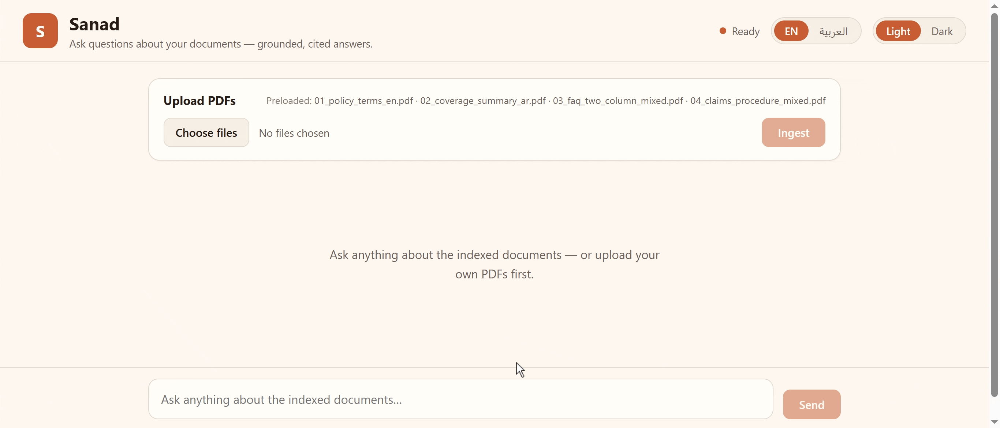

# Agentic RAG Assistant

> **Chat with your PDFs and get cited, grounded answers — hybrid retrieval + reranking, an agent that refuses to hallucinate, and a RAGAS harness that measures whether it actually works. Arabic + English.**



**Live demo:** [agentic-rag-assistant-5t1f.onrender.com](https://agentic-rag-assistant-5t1f.onrender.com)

## Problem → Approach → Result

**Problem.** Businesses want a bot that answers questions from *their* documents
without making things up. The two things most freelance RAG builds get wrong:
retrieval is naive (dense-only, no reranking), and nobody can *prove* the answers
are grounded.

**Approach.**
- **Hybrid retrieval** — dense (`bge-m3`) **and** sparse/BM25 vectors in Qdrant,
  fused with Reciprocal Rank Fusion, then reranked with `bge-reranker-v2-m3`.
- **Agentic layer** (LangGraph) — routes each question (retrieve vs. answer
  directly), forces `[source:page]` citations, and runs a **grounding gate**: if
  the retrieved context is too weak, it returns *"Not found in the provided
  documents"* instead of hallucinating.
- **Measurement** — a RAGAS harness scores **naive vs. hybrid+rerank** with an
  **independent judge** LLM (different model family from the generator, so answers
  aren't self-graded).
- **Multilingual** — works over Arabic + English documents (EN/AR UI toggle with RTL).

**Result.** End-to-end, deployed, and *measurable*: the anti-hallucination
grounding gate and a reproducible RAGAS evaluation are the differentiators. See
the numbers below and in [eval/report.md](eval/report.md).

### RAGAS results (naive vs. hybrid + rerank)

| Metric | Naive vector | Hybrid + rerank |
|---|---|---|
| faithfulness | 1.000 | 0.750 |
| answer_relevancy | 0.963 | 0.944 |
| context_precision | 1.000 | 0.902 |
| context_recall | 1.000 | 1.000 |

> ⚠️ **Illustrative smoke test — 2 questions only.** The full 16-question run was
> cut short by free-tier LLM-judge **rate limits**, so this is *not* a
> statistically meaningful comparison (here the tiny sample even favours naive).
> The pipeline supports the full set — re-run `python -m app.evaluate` with a
> higher-quota judge to reproduce it. Details in [eval/report.md](eval/report.md).

## Architecture

```
PDFs ─▶ ingest ─▶ chunk ─▶ embed (bge-m3 dense + bm25 sparse) ─▶ Qdrant (hybrid)

Q ─▶ agent ─┬─ route ── direct ─▶ answer
            └─ retrieve ─▶ hybrid search (RRF) ─▶ rerank (bge-reranker-v2-m3)
                        ─▶ grounding check ─▶ generate cited answer / "not found"
```

## Project layout

```
frontend/            React + TypeScript (Vite) UI — "Sanad" chat interface
app/                 backend package
  config.py          env-driven settings (paths, models, retrieval params)
  embeddings.py      dense (bge-m3) + sparse (bm25) loaders and embed helpers
  vector_store.py    Qdrant client, collection setup, upsert
  ingest.py          load PDFs -> chunk -> embed + upsert (CLI)
  retriever.py       hybrid dense+sparse retrieval fused with RRF, then rerank
  agent.py           LangGraph agent: route -> retrieve -> grounding -> generate
  api.py             FastAPI app: /api/* endpoints (frontend deploys separately)
data/pdfs/           the document corpus
eval/                ground-truth QA (ground_truth_qa.json / .csv) for RAGAS
qdrant_storage/      embedded on-disk vector index (gitignored, regenerable)
```

## Setup

```bash
python -m venv venv
./venv/Scripts/pip install -r requirements.txt   # Windows
cp .env.example .env                              # then add your GROQ_API_KEY
```

Storage defaults to **embedded** Qdrant (no Docker). To use a server or Qdrant
Cloud instead, set `QDRANT_URL` (+ `QDRANT_API_KEY`) in `.env`.

## Usage

Run everything as modules from the project root:

```bash
# Ingest the corpus (‑‑recreate rebuilds the index from scratch)
python -m app.ingest --pdf-dir data/pdfs --recreate

# Inspect retrieval for one query
python -m app.retriever "What does the policy cover?"

# Full agentic answer in the terminal
python -m app.agent "ما هي الاستثناءات في الوثيقة؟"

# Serve the API (docs at http://127.0.0.1:8000/docs)
python -m uvicorn app.api:app --host 127.0.0.1 --port 8000
```

### Frontend (React UI)

```bash
cd frontend
npm install        # first time
npm run dev        # http://localhost:5173  (proxies /api -> :8000)
```

Run the API (port 8000) and the frontend (port 5173) together — the Vite dev
server proxies `/api/*` to the backend. Features: EN/AR toggle with RTL, light/dark
themes, PDF upload, and cited answers with a collapsible Sources panel.

### API

| Method | Path          | Body                    | Returns |
|--------|---------------|-------------------------|---------|
| GET    | `/api/health` | —                       | readiness |
| POST   | `/api/chat`   | `{ "question": "..." }` | `{ answer, route, grounded, sources }` |
| POST   | `/api/ingest` | multipart PDF file(s)   | `{ sources, pages, chunks_indexed }` |
| POST   | `/api/eval`   | —                       | RAGAS eval (planned) |

> The embedded vector store is single-process: run the CLIs **or** the API
> server, not both at once (they contend for the same `qdrant_storage` lock).

## Run with Docker (backend)

The backend API + Qdrant run via Compose (the frontend runs separately — `npm run dev`):

```bash
# needs a .env at the repo root with OPENAI_API_KEY (the generator)
docker compose up --build
```

- API → **http://localhost:8000/api** (docs at `/docs`)

Then populate the index (the Qdrant service starts empty):

```bash
docker compose exec app python -m app.ingest --pdf-dir data/pdfs
```

Notes:
- Uses the **Qdrant service** (`QDRANT_URL=http://qdrant:6333`), not embedded mode.
- **First startup is slow:** it downloads the bge-m3 + reranker models (~4 GB)
  into the `model_cache` volume; later starts reuse it.
- torch is installed CPU-only to keep the image lean; no GPU dependency.

## Deploy (split: backend on HF Spaces, frontend on Render)

The models need ~5 GB RAM, so the **backend** goes where there's enough — **HF
Spaces' free CPU tier gives 16 GB** (Render's free tier is 512 MB and OOMs). The
lightweight **frontend** goes on Render as a static site.

**Backend → Hugging Face Space (Docker):** the repo is a ready Docker Space (see
the metadata at the top of this README).
1. Create a **Docker** Space, push this repo to it.
2. Space **secrets**: `OPENAI_API_KEY`, plus `QDRANT_URL` + `QDRANT_API_KEY` for a
   **Qdrant Cloud** cluster (free 1 GB — a Space's disk is ephemeral).
3. Ingest once into that cluster (from your machine, same `QDRANT_URL` in `.env`):
   `python -m app.ingest --pdf-dir data/pdfs`.
4. The Space builds the Dockerfile and boots the API on its URL.

**Frontend → Render (Static Site):**
1. New **Static Site**, root directory `frontend`.
2. Build command `npm ci && npm run build`, publish directory `dist`.
3. Env var **`VITE_API_URL`** = your HF Space URL (e.g. `https://<user>-<space>.hf.space`).
   The frontend then calls `<VITE_API_URL>/api/*`; CORS is open on the backend
   (tighten with `CORS_ORIGINS` if you like).

## Evaluation (RAGAS)

`python -m app.evaluate` scores retrieval quality — **naive vector search vs
hybrid + rerank** — on the ground-truth QA in `eval/`, using an **independent
judge** (different model family from the generator, so answers aren't
self-graded). Metrics: faithfulness, answer_relevancy, context_precision,
context_recall. Outputs: `eval/results.json`, `eval/report.md`,
`eval/ragas_comparison.png`, presented in `eval/ragas_eval.ipynb`.

> ⚠️ The committed numbers reflect **2 questions only** — the full 16-question
> run was cut short by free-tier LLM-judge **rate limits** (a local judge is
> impractically slow on CPU). They're an illustrative smoke test, not a
> statistically meaningful result; re-run with a higher-quota judge to reproduce
> the full evaluation. See [eval/report.md](eval/report.md).

## Notes

- On CPU, `bge-m3` + `bge-reranker-v2-m3` make ingestion and each answer take
  tens of seconds — expected; a GPU makes it fast.
- LLM provider is configurable (`LLM_PROVIDER=openai` default, or `gemini`).
