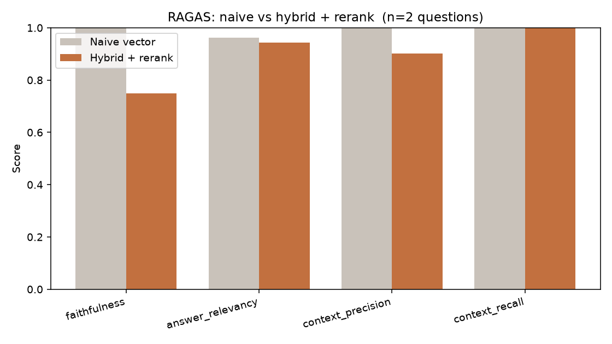

# RAGAS Evaluation — Naive vs Hybrid + Rerank

- **Generator:** openai/gpt-4o-mini
- **Judge:** groq/llama-3.3-70b-versatile (independent — different family from generator)
- **Questions:** 2  ·  **top-k:** 5

> ⚠️ **Limited sample — 2 questions only.** The full 16-question run was cut short by free-tier LLM-judge **rate limits**, so these scores are an illustrative smoke test, **not** a statistically meaningful result. The pipeline supports the full set — re-run `python -m app.evaluate` with a higher-quota judge to reproduce it.

| Metric | Naive vector | Hybrid + rerank | Δ |
|---|---|---|---|
| faithfulness | 1.000 | 0.750 | -0.250 |
| answer_relevancy | 0.963 | 0.944 | -0.019 |
| context_precision | 1.000 | 0.902 | -0.098 |
| context_recall | 1.000 | 1.000 | +0.000 |

*Higher is better for all four metrics. Faithfulness = answer is grounded in context; answer_relevancy = answer addresses the question; context_precision/recall = retrieval quality vs the ground truth.*